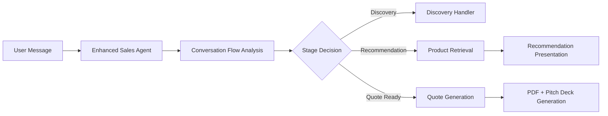

# B2B Sales Backend Architecture Diagram

```mermaid
graph TB
    %% Clients
    subgraph "Clients"
        CLIENT[Frontend App]
        ADMIN[Admin Interface]
        API_CLIENT[API Clients]
    end

    %% Gateway
    subgraph "Gateway"
        NGINX[Nginx Load Balancer]
    end

    %% Application
    subgraph "FastAPI Backend"
        APP[FastAPI App]

        subgraph "Routes"
            LEADS[Leads API]
            QUOTES[Quotes API]
            CHAT[Chat API]
            ADMIN_API[Admin API]
            SPEECH[Speech API]
            RECOMMENDATIONS[Recommendations API]
        end

        subgraph "Middleware"
            CORS[CORS]
            AUTH[Authentication]
            LOG[Logging]
        end
    end

    %% Enhanced B2B Sales Agent (Main Orchestrator)
    subgraph "Enhanced B2B Sales Agent"
        ENHANCED_SALES[Enhanced B2B Sales Agent<br/>Main Orchestrator]
        
        subgraph "Specialized AI Agents"
            CONVERSATION_FLOW[Conversation Flow Manager]
            QUOTE_AGENT[Quote Generation Agent]
            QUICK_RESPONSE[Quick Response Generator]
            HYBRID_RETRIEVER[Hybrid Product Retriever]
            STANDARD_RETRIEVER[Standard Product Retriever]
            DYNAMIC_EXTRACTOR[Dynamic Extraction Agent]
        end
    end

    %% AI Service Factory
    subgraph "AI Service Factory"
        AI_FACTORY[AI Service Factory]
        
        subgraph "AI Providers"
            AZURE_PROVIDER[Azure OpenAI Provider]
            HF_PROVIDER[HuggingFace Provider]
            TOKEN_TRACKER[Token Tracker]
        end
    end

    %% External AI Services
    subgraph "External AI Services"
        AZURE_OPENAI[Azure OpenAI GPT Models]
        AZURE_EMBED[Azure Embeddings API]
        WHISPER_MODELS[Whisper Models]
    end

    %% Business Services
    subgraph "Business Services"
        ELASTICSEARCH_SVC[Elasticsearch Service]
        CHROMA_SVC[ChromaDB Service]
        PDF_SVC[PDF Generator]
        PITCH_SVC[Pitch Deck Service]
        SPEECH_SVC[Speech Service]
        PROMPT_MGR[Prompt Manager]
    end

    %% Data Storage
    subgraph "Storage"
        POSTGRES[(PostgreSQL DB)]
        ELASTICSEARCH[(Elasticsearch)]
        CHROMA[(ChromaDB Vector Store)]
        FILES[File Storage<br/>JSON/PDFs/Pitch Decks]
    end

    %% Monitoring
    subgraph "Monitoring"
        KIBANA[Kibana Dashboard]
        ADMINER[Adminer DB Admin]
        HEALTH[Health Checks]
    end

    %% Client Connections
    CLIENT --> NGINX
    ADMIN --> NGINX
    API_CLIENT --> NGINX
    NGINX --> APP

    %% Middleware Flow
    APP --> CORS
    APP --> AUTH
    APP --> LOG

    %% Route Connections
    APP --> LEADS
    APP --> QUOTES
    APP --> CHAT
    APP --> ADMIN_API
    APP --> SPEECH
    APP --> RECOMMENDATIONS

    %% Main Route to Enhanced Sales Agent
    LEADS --> ENHANCED_SALES
    CHAT --> ENHANCED_SALES
    RECOMMENDATIONS --> ENHANCED_SALES

    %% Enhanced Sales Agent Internal Flow
    ENHANCED_SALES --> CONVERSATION_FLOW
    ENHANCED_SALES --> QUOTE_AGENT
    ENHANCED_SALES --> QUICK_RESPONSE
    ENHANCED_SALES --> HYBRID_RETRIEVER
    ENHANCED_SALES --> STANDARD_RETRIEVER
    ENHANCED_SALES --> DYNAMIC_EXTRACTOR

    %% AI Agent to AI Factory
    ENHANCED_SALES --> AI_FACTORY
    CONVERSATION_FLOW --> AI_FACTORY
    QUOTE_AGENT --> AI_FACTORY
    QUICK_RESPONSE --> AI_FACTORY
    HYBRID_RETRIEVER --> AI_FACTORY
    STANDARD_RETRIEVER --> AI_FACTORY
    DYNAMIC_EXTRACTOR --> AI_FACTORY

    %% AI Factory to Providers
    AI_FACTORY --> AZURE_PROVIDER
    AI_FACTORY --> HF_PROVIDER
    AI_FACTORY --> TOKEN_TRACKER

    %% Providers to External AI
    AZURE_PROVIDER --> AZURE_OPENAI
    CHROMA_SVC --> AZURE_EMBED
    SPEECH_SVC --> WHISPER_MODELS

    %% Business Service Integration
    ENHANCED_SALES --> ELASTICSEARCH_SVC
    ENHANCED_SALES --> CHROMA_SVC
    HYBRID_RETRIEVER --> ELASTICSEARCH_SVC
    HYBRID_RETRIEVER --> CHROMA_SVC
    STANDARD_RETRIEVER --> ELASTICSEARCH_SVC
    QUOTE_AGENT --> PDF_SVC
    QUOTE_AGENT --> PITCH_SVC
    SPEECH --> SPEECH_SVC
    ENHANCED_SALES --> PROMPT_MGR

    %% Direct API Routes
    QUOTES --> QUOTE_AGENT
    SPEECH --> SPEECH_SVC
    ADMIN_API --> ELASTICSEARCH_SVC

    %% Data Storage Connections
    APP --> POSTGRES
    ELASTICSEARCH_SVC --> ELASTICSEARCH
    CHROMA_SVC --> CHROMA
    PDF_SVC --> FILES
    PITCH_SVC --> FILES
    APP --> FILES

    %% Monitoring Connections
    ELASTICSEARCH --> KIBANA
    POSTGRES --> ADMINER
    APP --> HEALTH

    %% Styling
    classDef client fill:#e3f2fd
    classDef gateway fill:#bbdefb
    classDef app fill:#e1bee7
    classDef enhanced_agent fill:#ffecb3
    classDef ai_agent fill:#fff9c4
    classDef ai_factory fill:#f0f4c3
    classDef external_ai fill:#e8f5e8
    classDef service fill:#c8e6c9
    classDef storage fill:#d7ccc8
    classDef monitor fill:#f8bbd0

    class CLIENT,ADMIN,API_CLIENT client
    class NGINX gateway
    class APP,LEADS,QUOTES,CHAT,ADMIN_API,SPEECH,RECOMMENDATIONS,CORS,AUTH,LOG app
    class ENHANCED_SALES enhanced_agent
    class CONVERSATION_FLOW,QUOTE_AGENT,QUICK_RESPONSE,HYBRID_RETRIEVER,STANDARD_RETRIEVER,DYNAMIC_EXTRACTOR ai_agent
    class AI_FACTORY,AZURE_PROVIDER,HF_PROVIDER,TOKEN_TRACKER ai_factory
    class AZURE_OPENAI,AZURE_EMBED,WHISPER_MODELS external_ai
    class ELASTICSEARCH_SVC,CHROMA_SVC,PDF_SVC,PITCH_SVC,SPEECH_SVC,PROMPT_MGR service
    class POSTGRES,ELASTICSEARCH,CHROMA,FILES storage
    class KIBANA,ADMINER,HEALTH monitor
```



## Enhanced Architecture Analysis

### Key Architectural Components from `enhanced_b2b_sales_agent.py`:

#### 1. **Enhanced B2B Sales Agent (Main Orchestrator)**
- **Central Intelligence Hub**: Manages entire conversation flow and decision-making
- **Multi-Agent Coordinator**: Orchestrates specialized AI agents based on conversation stage
- **Caching System**: Maintains product recommendations cache for efficiency
- **Lazy User Detection**: Adapts conversation style based on user interaction patterns

#### 2. **Specialized AI Agent Hierarchy**
- **Conversation Flow Manager**: AI-powered conversation state analysis and flow control
- **Quote Generation Agent**: Handles complex quote generation with PDF/pitch deck creation
- **Quick Response Generator**: Provides fast contextual responses
- **Hybrid Product Retriever**: Combines Elasticsearch (keyword) + ChromaDB (semantic) search
- **Standard Product Retriever**: Fallback to Elasticsearch-only search
- **Dynamic Extraction Agent**: Extracts requirements and context from conversations

#### 3. **AI Service Factory Pattern**
- **Provider Abstraction**: Supports multiple AI providers (Azure OpenAI, HuggingFace)
- **Token Tracking**: Monitors AI service usage and costs
- **Configuration Management**: Handles API keys, endpoints, and model configurations

#### 4. **Intelligent Flow Management**


#### 5. **Hybrid Search Intelligence**
- **Elasticsearch**: Fast keyword matching for exact product specifications
- **ChromaDB**: Semantic similarity for understanding intent and context
- **Intelligent Merging**: Combines results with weighted scoring
- **Confidence Assessment**: Provides search confidence metrics

#### 6. **Advanced Features**
- **Multi-Modal Support**: Text and speech processing
- **Conversation Caching**: Prevents redundant processing
- **Progressive Discovery**: Stage-based information gathering
- **Quote Readiness Detection**: AI-powered decision making for quote timing
- **Pitch Deck Generation**: Automated presentation creation

## Data Flow Analysis

### 1. **Conversation Processing Flow**
```
User Input → Enhanced Sales Agent → Conversation Flow Analysis → Stage Routing → Specialized Agent → AI Provider → Response Generation
```

### 2. **Product Recommendation Flow**
```
Requirements Analysis → Hybrid Retriever → (Elasticsearch + ChromaDB) → Result Merging → Recommendation Ranking → Presentation
```

### 3. **Quote Generation Flow**
```
Quote Request → Enhanced Sales Agent → Quote Agent → PDF Generation → Pitch Deck Generation → Response Enhancement
```

### 4. **Intelligence Layers**
- **L1**: FastAPI Routes (HTTP handling)
- **L2**: Enhanced Sales Agent (orchestration)
- **L3**: Specialized Agents (domain expertise)  
- **L4**: AI Service Factory (provider abstraction)
- **L5**: External AI Services (Azure OpenAI, embeddings)

This architecture demonstrates a sophisticated multi-agent AI system with intelligent conversation flow management, hybrid search capabilities, and automated document generation - all orchestrated through the Enhanced B2B Sales Agent as the central intelligence hub. 