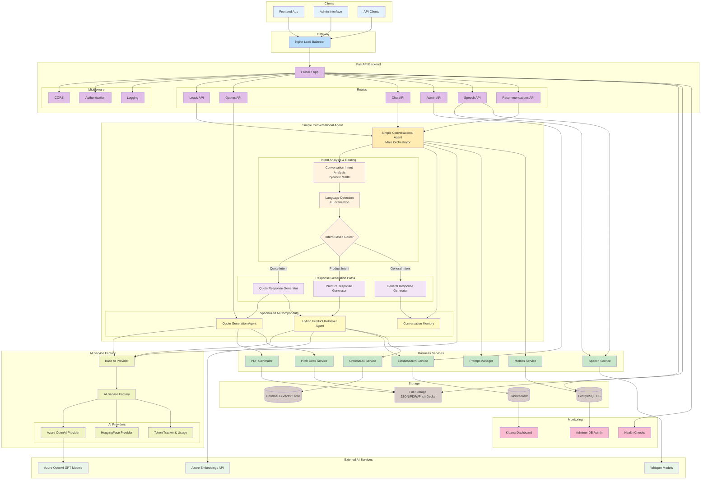
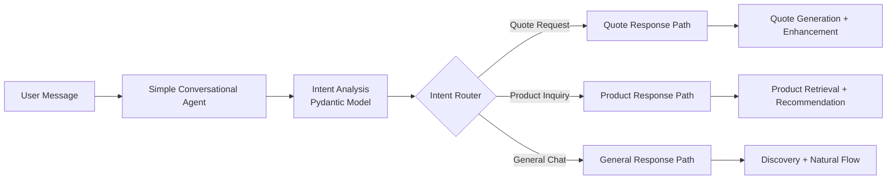

# B2B Sales Backend Architecture Diagram

## Simple Conversational Agent Architecture Analysis

### Key Architectural Components from `simple_conversational_agent.py`:

#### 1. **Simple Conversational Agent (Main Orchestrator)**
- **Conversation Orchestrator**: Manages entire conversation flow and response generation
- **Intent-Based Routing**: Uses Pydantic models to analyze and route conversations
- **Language-Aware Responses**: Detects language and provides localized responses
- **Memory Management**: Maintains conversation context and memory
- **Provider Abstraction**: Works with any base AI provider

#### 2. **Conversation Intent Analysis**
- **ConversationIntent Pydantic Model**: Structured analysis of user intent
- **Intent Types**: 'product_inquiry', 'quote_request', 'general_chat', 'technical_question', 'pricing_inquiry'
- **Confidence Scoring**: Provides confidence levels for decision-making
- **Missing Information Detection**: Identifies what information is needed
- **Conservative Product Retrieval**: Only retrieves products when explicitly needed

#### 3. **Three-Path Response Generation**
- **Quote Response Path**: Handles quote requests with missing info gathering
- **Product Response Path**: Manages product recommendations and full build suggestions
- **General Response Path**: Focuses on discovery and natural conversation flow
- **Dynamic Language Support**: Automatically detects and responds in appropriate language

#### 4. **Specialized AI Components**
- **HybridProductRetrieverAgent**: Combines Elasticsearch + ChromaDB for intelligent search
- **QuoteGenerationAgent**: Handles complex quote generation with PDF/pitch deck creation
- **Conversation Memory**: Maintains context across conversation turns

#### 5. **Intelligence Flow Management**

#### 6. **Advanced Features**
- **Language Detection & Localization**: Supports Japanese and English responses
- **Conservative Discovery Approach**: Focuses on information gathering before product recommendations
- **Quote Enhancement**: Automatically adds quote details, PDFs, and pitch decks to responses
- **Metrics Integration**: Tracks quote generation success/failure rates
- **Error Handling**: Graceful fallbacks for AI service failures

#### 7. **Conversation Flow Strategy**
- **Natural Conversation**: Prioritizes human-like, helpful interactions
- **Discovery-First Approach**: Gathers information before making recommendations
- **Context-Aware**: Uses conversation history and customer context
- **Requirements Completion**: Tracks missing information for quotes/recommendations

## Data Flow Analysis

### 1. **Intent Analysis Flow** 