# B2B Sales Backend Architecture Diagram

```mermaid
graph TB
    %% External Clients
    subgraph "External Clients"
        CLIENT[Frontend App]
        ADMIN[Admin Interface]
        API_CLIENT[API Clients]
    end

    %% Load Balancer / Gateway
    subgraph "API Gateway"
        NGINX[Load Balancer/Nginx]
    end

    %% Main Application Layer
    subgraph "FastAPI Application"
        APP[B2B Sales Backend<br/>FastAPI App]
        
        subgraph "Route Handlers"
            LEADS_ROUTE[Leads Router]
            QUOTES_ROUTE[Quotes Router]
            SPEECH_ROUTE[Speech Router]
            RECOMMENDATIONS_ROUTE[Recommendations Router]
            ADMIN_ROUTE[Admin Router]
            CHAT_ROUTE[Chat Endpoints]
        end
        
        subgraph "Middleware"
            CORS[CORS Middleware]
            AUTH[Authentication]
            LOGGING[Logging Middleware]
        end
    end

    %% AI Services Layer
    subgraph "AI Services"
        subgraph "AI Service Factory"
            AI_FACTORY[AI Service Factory]
            AZURE_AI[Azure OpenAI Provider]
            HF_AI[HuggingFace Provider]
            TOKEN_TRACKER[Token Tracker]
        end
        
        subgraph "Specialized AI Agents"
            SALES_AGENT[Enhanced B2B Sales Agent]
            PRODUCT_RETRIEVER[Product Retriever Agent]
            HYBRID_RETRIEVER[Hybrid Product Retriever Agent]
            QUOTE_AGENT[Quote Generation Agent]
            CONVERSATION_MANAGER[Conversation Flow Manager]
            DYNAMIC_EXTRACTOR[Dynamic Extraction Agent]
            QUICK_RESPONSE[Quick Response Generator]
        end
    end

    %% Business Services Layer
    subgraph "Business Services"
        ELASTICSEARCH_SVC[Elasticsearch Service]
        CHROMA_SVC[ChromaDB Service]
        SPEECH_SVC[Speech Service]
        PDF_SVC[PDF Generator]
        PITCH_SVC[Pitch Deck Service]
        PROMPT_MGR[Prompt Manager]
    end

    %% Data Layer
    subgraph "Data Storage"
        subgraph "Primary Database"
            POSTGRES[(PostgreSQL)]
            LEADS_TABLE[Leads Table]
            CHAT_TABLE[Chat Messages Table]
            QUOTES_TABLE[Quotes Table]
            RECOMMENDATIONS_TABLE[Recommendations Table]
        end
        
        subgraph "Search & Vector Storage"
            ELASTICSEARCH[(Elasticsearch)]
            CHROMA[(ChromaDB)]
            PRODUCTS_INDEX[Products Index]
            SOLUTIONS_INDEX[Solutions Index]
        end
        
        subgraph "File Storage"
            JSON_DATA[JSON Data Files]
            UPLOADS[Uploaded Files]
            QUOTES_FILES[Generated Quotes]
            PITCH_DECKS[Pitch Decks]
            LOGS[Application Logs]
        end
    end

    %% External AI Services
    subgraph "External AI Services"
        AZURE_OPENAI[Azure OpenAI]
        AZURE_EMBEDDING[Azure Embeddings]
        WHISPER[Whisper Models]
    end

    %% Monitoring & Admin
    subgraph "Monitoring & Admin"
        KIBANA[Kibana Dashboard]
        ADMINER[Database Admin]
        HEALTH[Health Check]
    end

    %% Data Models
    subgraph "Data Models"
        LEAD_MODEL[Lead Model]
        CHAT_MODEL[Chat Model]
        QUOTE_MODEL[Quote Model]
        RECOMMENDATION_MODEL[Recommendation Model]
        CATALOG_MODEL[Catalog Model]
    end

    %% Connection Flow
    CLIENT --> NGINX
    ADMIN --> NGINX
    API_CLIENT --> NGINX
    
    NGINX --> APP
    
    APP --> CORS
    APP --> AUTH
    APP --> LOGGING
    
    APP --> LEADS_ROUTE
    APP --> QUOTES_ROUTE
    APP --> SPEECH_ROUTE
    APP --> RECOMMENDATIONS_ROUTE
    APP --> ADMIN_ROUTE
    APP --> CHAT_ROUTE
    
    %% Route to Services
    LEADS_ROUTE --> SALES_AGENT
    QUOTES_ROUTE --> QUOTE_AGENT
    SPEECH_ROUTE --> SPEECH_SVC
    RECOMMENDATIONS_ROUTE --> PRODUCT_RETRIEVER
    ADMIN_ROUTE --> ELASTICSEARCH_SVC
    CHAT_ROUTE --> CONVERSATION_MANAGER
    
    %% AI Services Connections
    AI_FACTORY --> AZURE_AI
    AI_FACTORY --> HF_AI
    AI_FACTORY --> TOKEN_TRACKER
    
    SALES_AGENT --> AI_FACTORY
    PRODUCT_RETRIEVER --> AI_FACTORY
    HYBRID_RETRIEVER --> AI_FACTORY
    QUOTE_AGENT --> AI_FACTORY
    CONVERSATION_MANAGER --> AI_FACTORY
    DYNAMIC_EXTRACTOR --> AI_FACTORY
    QUICK_RESPONSE --> AI_FACTORY
    
    %% Business Services to External AI
    AZURE_AI --> AZURE_OPENAI
    CHROMA_SVC --> AZURE_EMBEDDING
    SPEECH_SVC --> WHISPER
    
    %% Business Services to Data
    ELASTICSEARCH_SVC --> ELASTICSEARCH
    CHROMA_SVC --> CHROMA
    PDF_SVC --> QUOTES_FILES
    PITCH_SVC --> PITCH_DECKS
    
    %% Database Connections
    APP --> POSTGRES
    POSTGRES --> LEADS_TABLE
    POSTGRES --> CHAT_TABLE
    POSTGRES --> QUOTES_TABLE
    POSTGRES --> RECOMMENDATIONS_TABLE
    
    %% Search Connections
    ELASTICSEARCH --> PRODUCTS_INDEX
    ELASTICSEARCH --> SOLUTIONS_INDEX
    
    %% File Storage
    APP --> JSON_DATA
    APP --> UPLOADS
    APP --> LOGS
    
    %% Monitoring
    ELASTICSEARCH --> KIBANA
    POSTGRES --> ADMINER
    APP --> HEALTH
    
    %% Data Models
    LEADS_TABLE --> LEAD_MODEL
    CHAT_TABLE --> CHAT_MODEL
    QUOTES_TABLE --> QUOTE_MODEL
    RECOMMENDATIONS_TABLE --> RECOMMENDATION_MODEL
    JSON_DATA --> CATALOG_MODEL

    %% Styling
    classDef external fill:#e1f5fe
    classDef app fill:#f3e5f5
    classDef ai fill:#fff3e0
    classDef service fill:#e8f5e8
    classDef data fill:#fff8e1
    classDef monitor fill:#fce4ec
    
    class CLIENT,ADMIN,API_CLIENT,AZURE_OPENAI,AZURE_EMBEDDING,WHISPER external
    class APP,LEADS_ROUTE,QUOTES_ROUTE,SPEECH_ROUTE,RECOMMENDATIONS_ROUTE,ADMIN_ROUTE,CHAT_ROUTE,CORS,AUTH,LOGGING app
    class AI_FACTORY,AZURE_AI,HF_AI,TOKEN_TRACKER,SALES_AGENT,PRODUCT_RETRIEVER,HYBRID_RETRIEVER,QUOTE_AGENT,CONVERSATION_MANAGER,DYNAMIC_EXTRACTOR,QUICK_RESPONSE ai
    class ELASTICSEARCH_SVC,CHROMA_SVC,SPEECH_SVC,PDF_SVC,PITCH_SVC,PROMPT_MGR service
    class POSTGRES,ELASTICSEARCH,CHROMA,LEADS_TABLE,CHAT_TABLE,QUOTES_TABLE,RECOMMENDATIONS_TABLE,PRODUCTS_INDEX,SOLUTIONS_INDEX,JSON_DATA,UPLOADS,QUOTES_FILES,PITCH_DECKS,LOGS data
    class KIBANA,ADMINER,HEALTH monitor
```

## Architecture Overview

### 1. **Client Layer**
- **Frontend App**: Main web application interface
- **Admin Interface**: Administrative dashboard
- **API Clients**: Third-party integrations

### 2. **API Gateway**
- **Load Balancer/Nginx**: Routes traffic and provides SSL termination

### 3. **Application Layer (FastAPI)**
- **Route Handlers**: Specialized routers for different domains
- **Middleware**: CORS, authentication, and logging
- **Main App**: Central FastAPI application

### 4. **AI Services Layer**
- **AI Service Factory**: Manages different AI providers
- **Specialized Agents**: Domain-specific AI agents for sales, products, quotes
- **Token Tracking**: Monitors AI service usage

### 5. **Business Services Layer**
- **Search Services**: Elasticsearch and ChromaDB integration
- **Document Services**: PDF generation and pitch deck creation
- **Speech Services**: Voice-to-text processing
- **Prompt Management**: Centralized prompt management

### 6. **Data Layer**
- **PostgreSQL**: Primary relational database
- **Elasticsearch**: Product and solution search
- **ChromaDB**: Vector database for semantic search
- **File Storage**: JSON data, uploads, generated documents

### 7. **External Services**
- **Azure OpenAI**: GPT models for conversation
- **Azure Embeddings**: Text embeddings for semantic search
- **Whisper Models**: Speech recognition

### 8. **Monitoring & Admin**
- **Kibana**: Elasticsearch monitoring
- **Adminer**: Database administration
- **Health Checks**: System health monitoring

## Key Features

1. **Multi-Modal AI**: Supports text and speech interactions
2. **Hybrid Search**: Combines keyword and semantic search
3. **Lead Management**: Complete lead lifecycle tracking
4. **Quote Generation**: Automated quote creation with PDF export
5. **Conversation Flow**: AI-driven conversation management
6. **Scalable Architecture**: Microservices-ready design
7. **Admin Dashboard**: Real-time monitoring and configuration

## Data Flow

1. Client requests → API Gateway → FastAPI Routes
2. Routes → AI Services → External AI Providers
3. AI Services → Business Services → Data Storage
4. Search queries → Elasticsearch/ChromaDB → Ranked results
5. Generated content → File Storage → Client delivery 